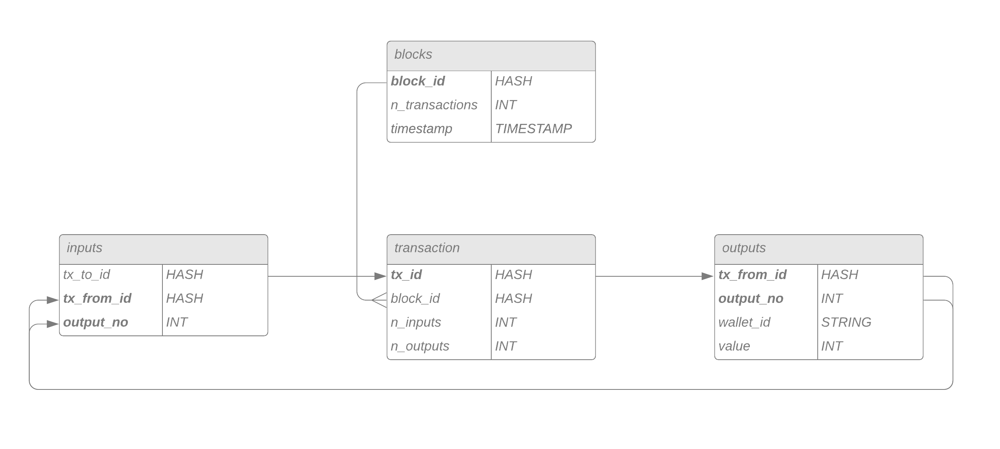
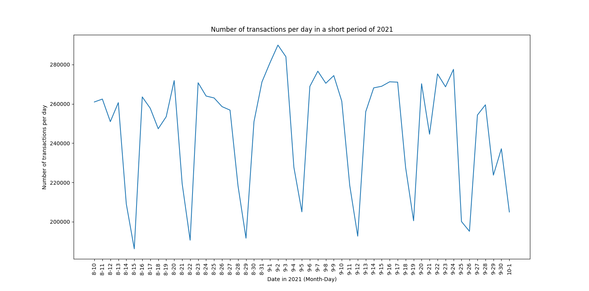
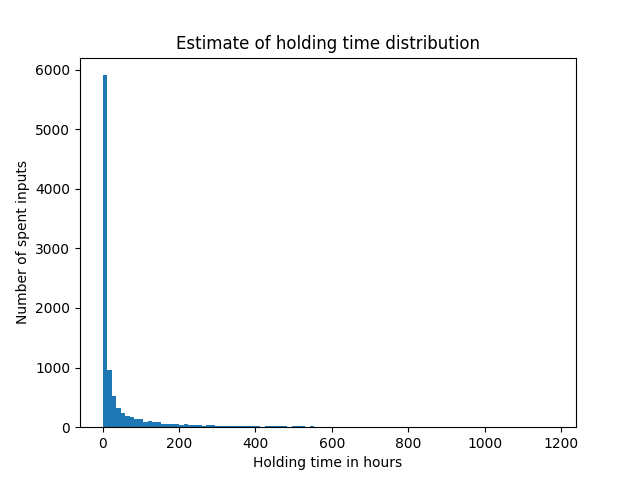

# blockchain-statistics
An indepth view into the dynamics of the bitcoin transaction network

This projects creates mySQL database for Bitcoin transactions and loads transactions into the database by reading the raw block files of the blockchain
The database schema is as follows:

It allows us to compute statistic like the the number of daily transactions.

We can also estimate the distribution of holding times for transaction outputs.

This is a visualization of the the sum of outputs per transaction for each day in September 2021.

